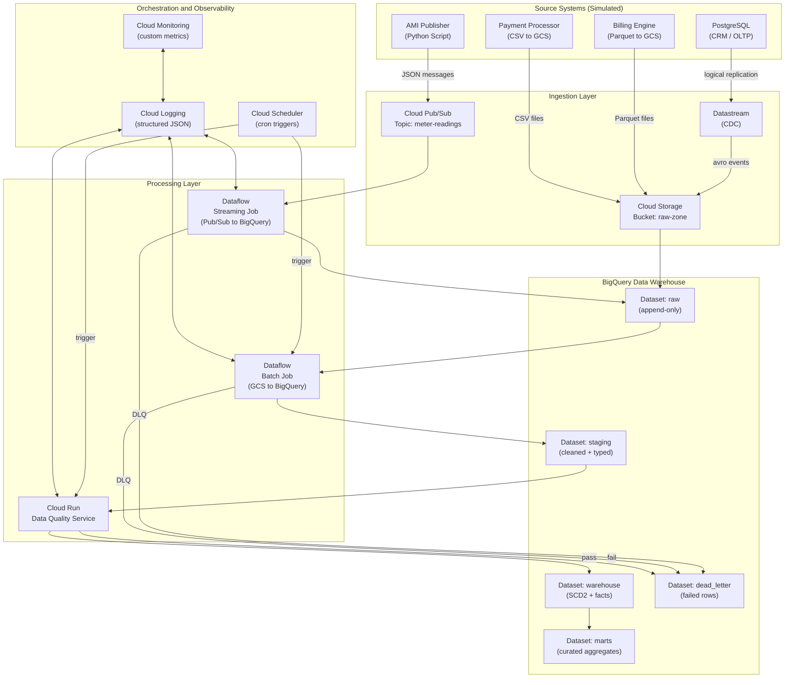
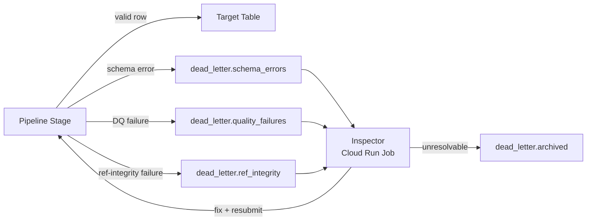

# Architecture: Utility Meter-to-Cash Cloud Data Platform

## 1. Business Problem

Utility companies (electricity, gas, water) generate high-volume transactional data across an
end-to-end value chain: customers are enrolled, meters are installed, readings are collected,
bills are calculated, and payments are reconciled. In a typical enterprise, this data is
fragmented across operational databases, flat-file exports, and legacy batch jobs.

This project simulates a **cloud-native data platform** that ingests, unifies, and serves all
Meter-to-Cash data in a single, governed BigQuery data warehouse — enabling operational
reporting, financial reconciliation, customer analytics, and revenue assurance.

---

## 2. Functional Requirements

| ID    | Requirement |
|-------|-------------|
| FR-01 | Ingest customer, account, contract, and service-point master data from a simulated OLTP database via Change Data Capture (CDC). |
| FR-02 | Ingest high-volume meter readings from a simulated IoT/AMI system via a streaming message queue. |
| FR-03 | Ingest billing and payment records from a simulated billing engine via batch file drops to Cloud Storage. |
| FR-04 | Apply data quality checks (completeness, validity, referential integrity) at every ingestion boundary. |
| FR-05 | Route records that fail quality checks to a dead-letter store for inspection and re-processing. |
| FR-06 | Support full historical backfills for all entities when a source system is reset or a new table is added. |
| FR-07 | Maintain full audit history (insert, update, delete) using SCD Type 2 patterns in the warehouse layer. |
| FR-08 | Expose curated mart tables for: revenue summary, bill-to-payment lag, unbilled meter readings, and customer churn signals. |
| FR-09 | Provide pipeline observability via structured logs, row-count metrics, and a basic monitoring dashboard. |
| FR-10 | All warehouse tables must carry a `dw_inserted_at` and `dw_updated_at` metadata timestamp. |

---

## 3. Non-Functional Requirements

| ID     | Requirement | Target |
|--------|-------------|--------|
| NFR-01 | Streaming meter-reading latency (Pub/Sub → BigQuery) | < 5 minutes end-to-end |
| NFR-02 | CDC lag for master data | < 15 minutes |
| NFR-03 | Batch file ingestion SLA | Within 30 minutes of file drop |
| NFR-04 | Data quality gate pass rate for production mart tables | >= 99% of rows |
| NFR-05 | Pipeline re-runnability | All pipelines are idempotent |
| NFR-06 | Cost | Operate within GCP free-tier / $50 monthly budget for a student project |
| NFR-07 | Security | No PII stored in plain text in raw layer; pseudonymized in staging |
| NFR-08 | Observability | Every pipeline emits structured JSON logs to Cloud Logging |

---

## 4. Source-System Assumptions

This is a **simulated** platform. No SAP IS-U or real operational systems are involved.
The following source systems are simulated with synthetic data generators written in Python:

| Source System | Simulation Method | Transport |
|---------------|-------------------|-----------|
| **CRM / OLTP** — Customer, Account, Contract, Service Point | PostgreSQL running in Cloud Run (or locally), seeded with Faker | Datastream (PostgreSQL CDC) |
| **AMI / Meter Reading System** | Python publisher script pushing JSON events | Cloud Pub/Sub |
| **Billing Engine** | Python batch script writing Parquet files | Cloud Storage bucket drop |
| **Payment Processor** | Python batch script writing CSV files | Cloud Storage bucket drop |

> **Key assumption:** The OLTP database exposes PostgreSQL logical replication (`wal_level = logical`),
> which Datastream requires. The simulated container is configured accordingly.

---

## 5. Proposed GCP Architecture

### 5.1 Layer Overview

### 5.2 Layer Responsibilities

#### Raw Zone (`BigQuery: raw` + `GCS: raw-zone`)
- **Purpose:** Immutable landing area. Rows are appended, never updated.
- **Schema:** Source schema + metadata columns (`_source_table`, `_ingested_at`, `_operation` for CDC).
- **Retention:** GCS objects: 90 days. BigQuery raw tables: 365 days (partition expiry).
- **Who writes:** Datastream, Dataflow streaming job, GCS event triggers.

#### Staging Layer (`BigQuery: staging`)
- **Purpose:** Type casting, null coalescing, deduplication, and pseudonymization of PII.
- **Pattern:** Incremental `MERGE` or `INSERT OVERWRITE` on daily partitions.
- **SCD:** No history kept here — staging holds only the latest record per natural key.
- **Who writes:** Dataflow batch jobs (scheduled via Cloud Scheduler).

#### Warehouse Layer (`BigQuery: warehouse`)
- **Purpose:** Authoritative, historized version of all entities.
- **Pattern:** SCD Type 2 for slowly changing dimensions (Customer, Account, Contract).
  Append-only fact tables for Meter Reading, Bill, Payment.
- **Who writes:** Cloud Run data-quality + transformation service.

#### Marts Layer (`BigQuery: marts`)
- **Purpose:** Pre-aggregated views and tables for analytics consumers.
- **Pattern:** Scheduled BigQuery SQL jobs (materialized views where cost-effective).
- **Examples:** `mart_revenue_monthly`, `mart_bill_payment_lag`, `mart_unbilled_readings`.
- **Who writes:** BigQuery scheduled queries.

#### Dead-Letter Store (`BigQuery: dead_letter`)
- **Purpose:** Capture every row that fails schema validation, data quality, or referential integrity.
- **Schema:** `source_table`, `raw_payload` (JSON), `error_code`, `error_message`, `failed_at`.
- **Who writes:** Every pipeline stage that applies quality checks.

---

## 6. Ingestion Strategies

### 6.1 CDC via Datastream (Master Data)
- Datastream reads PostgreSQL WAL and writes Avro files to `gs://raw-zone/datastream/`.
- A GCS notification triggers a Dataflow batch job that parses Avro, enforces schema, and
  appends to `raw.<table>`.
- The `_operation` column carries `INSERT`, `UPDATE`, or `DELETE`.
- Datastream is configured for **private connectivity** using a VPC peering profile.

### 6.2 Streaming via Pub/Sub (Meter Readings)
- The AMI simulator publishes JSON messages to the `meter-readings` Pub/Sub topic.
- A Dataflow **Streaming** job (Apache Beam with Python SDK) reads from the subscription,
  validates the schema, enriches with `ingested_at`, and streams directly to
  `raw.meter_reading`.
- A dead-letter Pub/Sub topic (`meter-readings-dlq`) catches unparse-able messages before
  they hit BigQuery.

### 6.3 Batch File Drop (Billing & Payments)
- The billing/payment simulators write Parquet / CSV files to `gs://raw-zone/billing/` and
  `gs://raw-zone/payments/`.
- Cloud Scheduler triggers a Cloud Run job every 30 minutes that:
  1. Lists new files (using a processed-files manifest in GCS).
  2. Submits a Dataflow batch job per file.
  3. Updates the manifest on success.

---

## 7. Failure-Handling Strategy

| Failure Type | Handling |
|---|---|
| Malformed JSON / Avro | Route to `dead_letter.schema_errors`; increment `dlq_count` metric. |
| Missing required field | Route to `dead_letter.quality_failures` with `error_code = NULL_REQUIRED`. |
| Unknown foreign key | Route to `dead_letter.ref_integrity`; retry after parent record arrives (up to 3 attempts). |
| Dataflow job failure | Cloud Scheduler will retry the job trigger. Dataflow checkpoints prevent re-reading. |
| Datastream lag spike | Alert via Cloud Monitoring; no data loss (WAL is retained). |

All DLQ tables include:
- `retry_count INT64`
- `last_retry_at TIMESTAMP`
- `resolution_status STRING` (PENDING, REPROCESSED, ABANDONED)

---

## 8. Backfill Strategy

| Scenario | Strategy |
|---|---|
| **Initial load** | Run Datastream in `BACKFILL` mode (full table snapshot). Dataflow batch job processes the resulting Avro snapshot files. |
| **New column added** | Add column to staging/warehouse with `NULL` default. Trigger a partition-scoped backfill Dataflow job over the affected date range. |
| **DQ rule tightened** | Re-run the Cloud Run DQ service over the affected staging partition; failed rows go to DLQ. |
| **Historical file drop** | Place file in `gs://raw-zone/backfill/<table>/`. A separate Dataflow batch job with `--backfill=true` flag processes it and upserts into staging (bypassing the new-files manifest). |
| **Logical deletion** | If source issues a hard delete, Datastream captures the `DELETE` operation. Warehouse SCD2 row is closed (`is_current = FALSE`, `valid_to = deleted_at`). |

All backfill jobs use `--pipeline_mode=BACKFILL` and write to raw/staging with a special
`_load_type = 'BACKFILL'` metadata flag for auditability.

---

## 9. Data Quality Strategy

Quality checks are executed by a **Cloud Run** service written in Python.

### Quality Dimensions

| Dimension | Example Rule |
|---|---|
| **Completeness** | `customer_id IS NOT NULL`, `reading_value IS NOT NULL` |
| **Validity** | `reading_value >= 0`, `email LIKE '%@%.%'` |
| **Uniqueness** | No duplicate `(meter_id, read_at)` within a batch |
| **Referential Integrity** | Every `meter_reading.meter_id` exists in `warehouse.dim_meter` |
| **Timeliness** | `read_at` not more than 48 hours in the past at ingestion time |
| **Consistency** | `bill_amount = sum(line_items)` (cross-table check) |

### Quality Gate
- Runs **after** staging, **before** writing to warehouse.
- If row-level pass rate drops below **99%** for a batch, the batch is quarantined to DLQ
  and an alert is fired. The warehouse is NOT written to with a partial batch.
- Results are stored in `warehouse.dq_run_log` with `batch_id`, `table_name`,
  `rows_checked`, `rows_passed`, `rows_failed`, `run_at`.

---

## 10. Observability

| Signal | Tool | Details |
|---|---|---|
| Structured logs | Cloud Logging | Every pipeline emits `{"pipeline": ..., "batch_id": ..., "rows_read": ..., "rows_written": ..., "rows_dlq": ..., "duration_s": ...}` |
| Custom metrics | Cloud Monitoring | `meter_to_cash/rows_dlq_total`, `meter_to_cash/pipeline_lag_seconds` |
| Alerting | Cloud Monitoring Alert Policies | Alert if DLQ count > 100 in 10 min, or pipeline lag > 15 min |
| Job lineage | BigQuery `INFORMATION_SCHEMA.JOBS` | Queried by the observability dashboard |
| Dashboard | Looker Studio (free tier) | Connected to `marts.mart_pipeline_health` view |

---

## 11. Security and IAM Considerations

### Service Accounts

| Service Account | Role | Least-Privilege Scope |
|---|---|---|
| `sa-datastream@project` | `roles/datastream.admin` | Datastream connection only |
| `sa-dataflow@project` | `roles/dataflow.worker`, `roles/bigquery.dataEditor`, `roles/storage.objectViewer` | Specific datasets + buckets |
| `sa-cloudrun@project` | `roles/bigquery.dataEditor`, `roles/storage.objectAdmin` | DQ service datasets |
| `sa-scheduler@project` | `roles/cloudrun.invoker`, `roles/dataflow.developer` | Trigger permissions only |

### Data Classification

| Sensitivity | Fields | Control |
|---|---|---|
| PII | `customer.name`, `customer.email`, `customer.phone` | SHA-256 pseudonymization in staging; raw layer access restricted |
| Financial | `payment.amount`, `bill.total_amount` | Column-level access control in BigQuery |
| Internal | All other operational fields | Standard IAM |

### Network
- All GCP services communicate within a **private VPC**.
- Cloud Storage and BigQuery accessed via **VPC Service Controls** perimeter.
- No public IPs on Dataflow workers.

---

## 12. Cost-Control Considerations

| Concern | Mitigation |
|---|---|
| BigQuery query costs | Raw/staging tables are **partitioned by date** and **clustered** by natural key. Mart queries use `WHERE partition_date = ...` to limit scan. |
| Dataflow worker cost | Streaming job uses `e2-medium` with autoscaling min=1, max=2. Batch jobs spin up only when triggered. |
| Datastream cost | Limit to tables with active CDC; historical tables excluded from Datastream stream. |
| Storage cost | GCS lifecycle rule: delete raw objects after 90 days. BigQuery raw tables: 365-day partition expiry. |
| Cloud Run cost | DQ service runs only on schedule (not always-on); billed per invocation. |
| Pub/Sub cost | Message retention set to 7 days; subscriber acks messages immediately after Dataflow commits. |

**Estimated monthly cost (student project, low volume):** < $15/month with careful configuration.

---

## 13. Success Criteria

| Criterion | Measurable Target |
|---|---|
| All 8 domain entities loaded into warehouse | 100% of entities present in `warehouse.*` tables |
| CDC latency | Datastream lag < 15 minutes on steady state |
| Streaming latency | Pub/Sub to BigQuery < 5 minutes P95 |
| Data quality pass rate | >= 99% of rows pass all quality gates |
| DLQ reprocessing | 100% of DLQ rows have `resolution_status` set (no orphans) |
| SCD2 correctness | Changing a customer's address generates a new SCD2 row; history is preserved |
| Backfill idempotency | Running a backfill twice produces no duplicate rows in warehouse |
| Mart accuracy | `mart_revenue_monthly` matches hand-calculated sum from source payment records |
| Observability | Every pipeline run produces a log entry in Cloud Logging with row counts |
| Cost | Total GCP spend < $50 for a full month of development |
