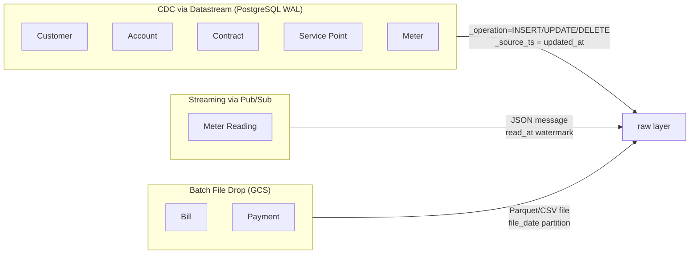
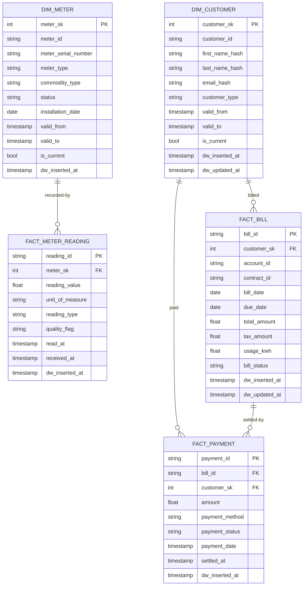

# Domain Model: Utility Meter-to-Cash

## 1. Domain Overview

The Meter-to-Cash domain covers every step from enrolling a customer to collecting payment:

```
Customer → Account → Contract → Service Point → Meter → Meter Reading → Bill → Payment
```

Each entity has a clear lifecycle and relationships. The model is intentionally simplified
to remain implementable while remaining representative of real utility domain complexity.

---

## 2. Entity-Relationship Diagram

```mermaid
erDiagram
    CUSTOMER {
        string customer_id PK
        string first_name
        string last_name
        string email
        string phone
        string customer_type
        date   date_of_birth
        timestamp created_at
        timestamp updated_at
    }

    ACCOUNT {
        string account_id PK
        string customer_id FK
        string account_status
        string billing_cycle
        string payment_method
        timestamp created_at
        timestamp updated_at
    }

    CONTRACT {
        string contract_id PK
        string account_id FK
        string tariff_code
        string commodity_type
        date   start_date
        date   end_date
        string contract_status
        timestamp created_at
        timestamp updated_at
    }

    SERVICE_POINT {
        string service_point_id PK
        string contract_id FK
        string address_line_1
        string address_line_2
        string city
        string state
        string postal_code
        string country
        string grid_zone
        timestamp created_at
        timestamp updated_at
    }

    METER {
        string meter_id PK
        string service_point_id FK
        string meter_serial_number
        string meter_type
        string commodity_type
        string status
        date   installation_date
        date   decommission_date
        timestamp created_at
        timestamp updated_at
    }

    METER_READING {
        string reading_id PK
        string meter_id FK
        float  reading_value
        string unit_of_measure
        string reading_type
        timestamp read_at
        timestamp received_at
        string source_system
        string quality_flag
    }

    BILL {
        string bill_id PK
        string account_id FK
        string contract_id FK
        date   bill_date
        date   due_date
        date   period_start
        date   period_end
        float  total_amount
        string currency
        string bill_status
        float  tax_amount
        float  usage_kwh
        timestamp created_at
        timestamp updated_at
    }

    PAYMENT {
        string payment_id PK
        string bill_id FK
        string account_id FK
        float  amount
        string currency
        string payment_method
        string payment_status
        timestamp payment_date
        timestamp settled_at
        timestamp created_at
    }

    CUSTOMER ||--o{ ACCOUNT : "holds"
    ACCOUNT ||--o{ CONTRACT : "governs"
    CONTRACT ||--o{ SERVICE_POINT : "covers"
    SERVICE_POINT ||--o{ METER : "hosts"
    METER ||--o{ METER_READING : "produces"
    ACCOUNT ||--o{ BILL : "receives"
    CONTRACT ||--o{ BILL : "billed-under"
    BILL ||--o{ PAYMENT : "settled-by"
```



---

## 3. Entity Descriptions

### 3.1 Customer
Represents an individual or organization that has a relationship with the utility.

| Attribute | Type | Notes |
|---|---|---|
| `customer_id` | STRING (UUID) | Surrogate PK, generated by OLTP |
| `first_name` | STRING | PII — pseudonymized in staging |
| `last_name` | STRING | PII — pseudonymized in staging |
| `email` | STRING | PII — pseudonymized in staging |
| `phone` | STRING | PII — pseudonymized in staging |
| `customer_type` | STRING | ENUM: RESIDENTIAL, COMMERCIAL, INDUSTRIAL |
| `date_of_birth` | DATE | PII — masked in staging |
| `created_at` | TIMESTAMP | OLTP record creation time |
| `updated_at` | TIMESTAMP | OLTP last-update time; used for CDC watermarking |

**SCD Strategy:** SCD Type 2 in warehouse. A new version row is created whenever
`email`, `phone`, or `customer_type` changes.

---

### 3.2 Account
A billing account associated with a customer. One customer may have multiple accounts
(e.g., home + business).

| Attribute | Type | Notes |
|---|---|---|
| `account_id` | STRING (UUID) | Surrogate PK |
| `customer_id` | STRING (UUID) | FK → Customer |
| `account_status` | STRING | ENUM: ACTIVE, SUSPENDED, CLOSED |
| `billing_cycle` | STRING | ENUM: MONTHLY, QUARTERLY, ANNUAL |
| `payment_method` | STRING | ENUM: DIRECT_DEBIT, CREDIT_CARD, CHEQUE, BANK_TRANSFER |
| `created_at` | TIMESTAMP | |
| `updated_at` | TIMESTAMP | CDC watermark |

**SCD Strategy:** SCD Type 2. `account_status` changes trigger a new version.

---

### 3.3 Contract
A service agreement between the account holder and the utility, specifying tariff and commodity.

| Attribute | Type | Notes |
|---|---|---|
| `contract_id` | STRING (UUID) | Surrogate PK |
| `account_id` | STRING (UUID) | FK → Account |
| `tariff_code` | STRING | E.g., `RESI-FLAT-E1`, `COMM-TOU-G2` |
| `commodity_type` | STRING | ENUM: ELECTRICITY, GAS, WATER |
| `start_date` | DATE | Contract effective start |
| `end_date` | DATE | NULL if open-ended |
| `contract_status` | STRING | ENUM: ACTIVE, EXPIRED, TERMINATED |
| `created_at` | TIMESTAMP | |
| `updated_at` | TIMESTAMP | CDC watermark |

**SCD Strategy:** SCD Type 2. `tariff_code` or `contract_status` changes create a new version.

---

### 3.4 Service Point
The physical delivery location — a premise address where the utility is delivered.

| Attribute | Type | Notes |
|---|---|---|
| `service_point_id` | STRING (UUID) | Surrogate PK |
| `contract_id` | STRING (UUID) | FK → Contract |
| `address_line_1` | STRING | |
| `address_line_2` | STRING | Nullable |
| `city` | STRING | |
| `state` | STRING | |
| `postal_code` | STRING | |
| `country` | STRING | ISO 3166-1 alpha-2 |
| `grid_zone` | STRING | Distribution zone code |
| `created_at` | TIMESTAMP | |
| `updated_at` | TIMESTAMP | CDC watermark |

**SCD Strategy:** SCD Type 1 (overwrite). Address corrections are not considered history-worthy.

---

### 3.5 Meter
A physical metering device installed at a service point.

| Attribute | Type | Notes |
|---|---|---|
| `meter_id` | STRING (UUID) | Surrogate PK |
| `service_point_id` | STRING (UUID) | FK → Service Point |
| `meter_serial_number` | STRING | Manufacturer serial; natural key |
| `meter_type` | STRING | ENUM: AMI (smart), AMR (remote-read), MANUAL |
| `commodity_type` | STRING | ENUM: ELECTRICITY, GAS, WATER |
| `status` | STRING | ENUM: ACTIVE, INACTIVE, DECOMMISSIONED |
| `installation_date` | DATE | |
| `decommission_date` | DATE | NULL if still active |
| `created_at` | TIMESTAMP | |
| `updated_at` | TIMESTAMP | CDC watermark |

**SCD Strategy:** SCD Type 2. `status` changes (e.g., ACTIVE → DECOMMISSIONED) create a new version.

---

### 3.6 Meter Reading
A time-series measurement from a meter. High-volume; streamed via Pub/Sub.

| Attribute | Type | Notes |
|---|---|---|
| `reading_id` | STRING (UUID) | PK; generated by AMI simulator |
| `meter_id` | STRING (UUID) | FK → Meter |
| `reading_value` | FLOAT64 | Cumulative or interval reading |
| `unit_of_measure` | STRING | ENUM: kWh, m3, liters |
| `reading_type` | STRING | ENUM: INTERVAL, CUMULATIVE, MANUAL |
| `read_at` | TIMESTAMP | Time of actual measurement (device clock) |
| `received_at` | TIMESTAMP | Time message arrived at Pub/Sub |
| `source_system` | STRING | Simulator identifier |
| `quality_flag` | STRING | ENUM: VALID, ESTIMATED, SUSPECT, REJECTED |

**SCD Strategy:** Append-only fact. No updates; suspect readings are flagged, not corrected in-place.

---

### 3.7 Bill
A periodic invoice generated by the billing engine.

| Attribute | Type | Notes |
|---|---|---|
| `bill_id` | STRING (UUID) | PK |
| `account_id` | STRING (UUID) | FK → Account |
| `contract_id` | STRING (UUID) | FK → Contract |
| `bill_date` | DATE | Date bill was generated |
| `due_date` | DATE | Payment deadline |
| `period_start` | DATE | Billing period start |
| `period_end` | DATE | Billing period end |
| `total_amount` | NUMERIC | Gross amount due |
| `currency` | STRING | ISO 4217; e.g., USD |
| `bill_status` | STRING | ENUM: ISSUED, PAID, OVERDUE, CANCELLED, DISPUTED |
| `tax_amount` | NUMERIC | Total tax component |
| `usage_kwh` | FLOAT64 | Total consumption in billing period |
| `created_at` | TIMESTAMP | |
| `updated_at` | TIMESTAMP | |

**SCD Strategy:** Append-only fact. `bill_status` changes are captured as new CDC events and
reflected as an update in the warehouse `bill_status` column (Type 1 overwrite for status only).

---

### 3.8 Payment
A payment transaction against a bill.

| Attribute | Type | Notes |
|---|---|---|
| `payment_id` | STRING (UUID) | PK |
| `bill_id` | STRING (UUID) | FK → Bill |
| `account_id` | STRING (UUID) | FK → Account (for direct lookups) |
| `amount` | NUMERIC | Amount tendered |
| `currency` | STRING | ISO 4217 |
| `payment_method` | STRING | ENUM: DIRECT_DEBIT, CREDIT_CARD, CHEQUE, BANK_TRANSFER |
| `payment_status` | STRING | ENUM: PENDING, CLEARED, REVERSED, FAILED |
| `payment_date` | TIMESTAMP | When customer initiated payment |
| `settled_at` | TIMESTAMP | When funds cleared; NULL until settlement |
| `created_at` | TIMESTAMP | Record creation time |

**SCD Strategy:** Append-only fact. Reversals and failures are new rows, not updates.

---

## 4. Incremental / CDC Strategy Per Entity



| Entity | CDC Mechanism | Watermark Column | Dedup Key |
|---|---|---|---|
| Customer | Datastream (WAL) | `updated_at` | `customer_id` |
| Account | Datastream (WAL) | `updated_at` | `account_id` |
| Contract | Datastream (WAL) | `updated_at` | `contract_id` |
| Service Point | Datastream (WAL) | `updated_at` | `service_point_id` |
| Meter | Datastream (WAL) | `updated_at` | `meter_id` |
| Meter Reading | Pub/Sub (streaming) | `read_at` | `reading_id` |
| Bill | Batch file drop | `bill_date` (file partition) | `bill_id` |
| Payment | Batch file drop | `payment_date` (file partition) | `payment_id` |

---

## 5. Warehouse Layer Model

The warehouse follows a **hybrid Kimball / Data Vault** approach:
- **Dimensions** use SCD Type 2 with surrogate keys.
- **Facts** are append-only with natural keys preserved.



---

## 6. Marts Layer

| Mart Table | Grain | Description |
|---|---|---|
| `mart_revenue_monthly` | account + month | Total billed amount vs. total collected amount per account per month |
| `mart_bill_payment_lag` | bill_id | Days between `bill_date` and `settled_at`; identifies late payers |
| `mart_unbilled_readings` | meter_id + day | Meter readings not yet associated with a bill; revenue assurance signal |
| `mart_customer_churn_signals` | customer_id + month | Count of payment failures, disputes, and account suspensions |
| `mart_pipeline_health` | pipeline + run_date | Row counts in/out/dlq per pipeline run; used by observability dashboard |
