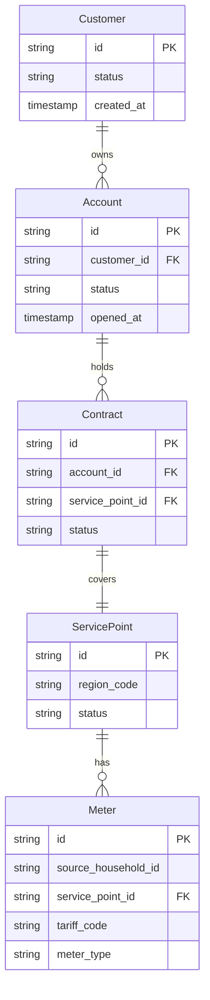

# Master Data Design

## Overview
This document specifies the synthetic master-data generation strategy that layers simulated business entities on top of real UKPN smart-meter data.

## Entity Relationships
The operational model uses a strict 1:1 deterministic mapping originating from the real `source_household_id`.

## Deterministic Mapping Logic
Given a real `household_id` (e.g., `MAC000002`):
- **source_household_id**: `MAC000002` (Real UKPN ID)
- **meter_id**: `METER-000002` (Synthetic, strips "MAC" and prepends "METER-", matches existing ingestion logic)
- **service_point_id**: `SP-000002` (Synthetic)
- **contract_id**: `CTR-000002` (Synthetic)
- **account_id**: `ACC-000002` (Synthetic)
- **customer_id**: `CUS-000002` (Synthetic)

## Lineage Clarity
- **Real Data**: The `household_id` and the `tariff_code` (mapped directly from `stdorToU`) are real.
- **Synthetic Data**: All IDs (other than the real household ID), relationships, and statuses are synthetic/project-generated. They do not originate from UKPN or SAP.
